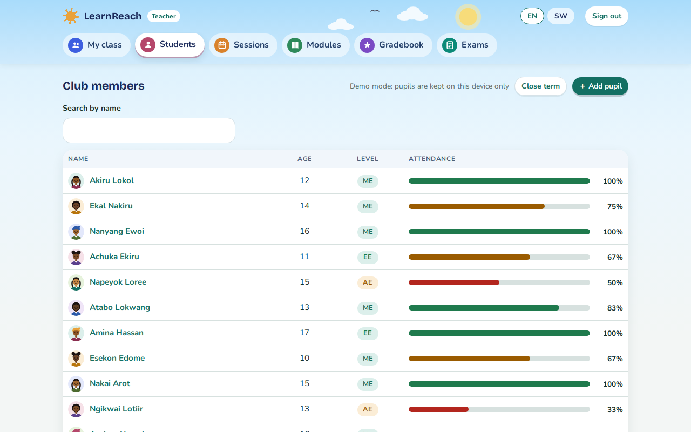
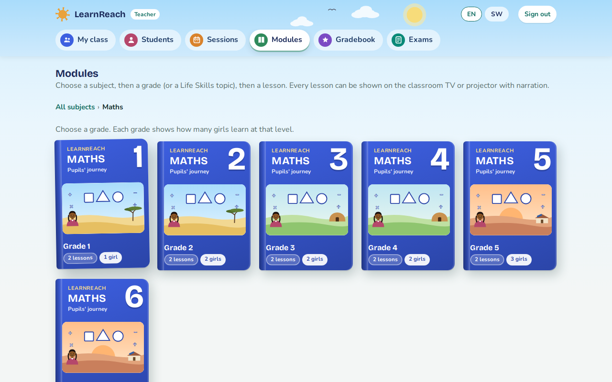
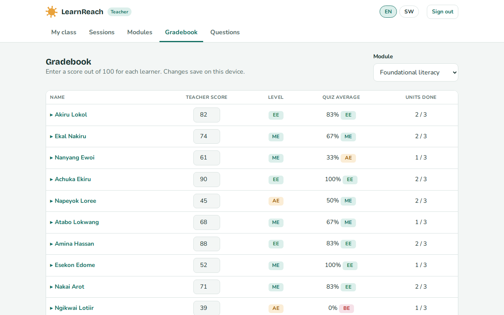
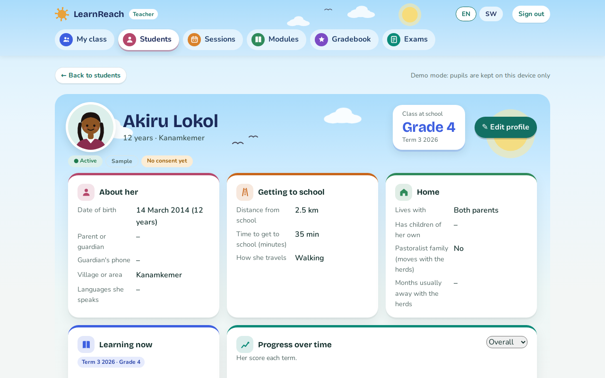
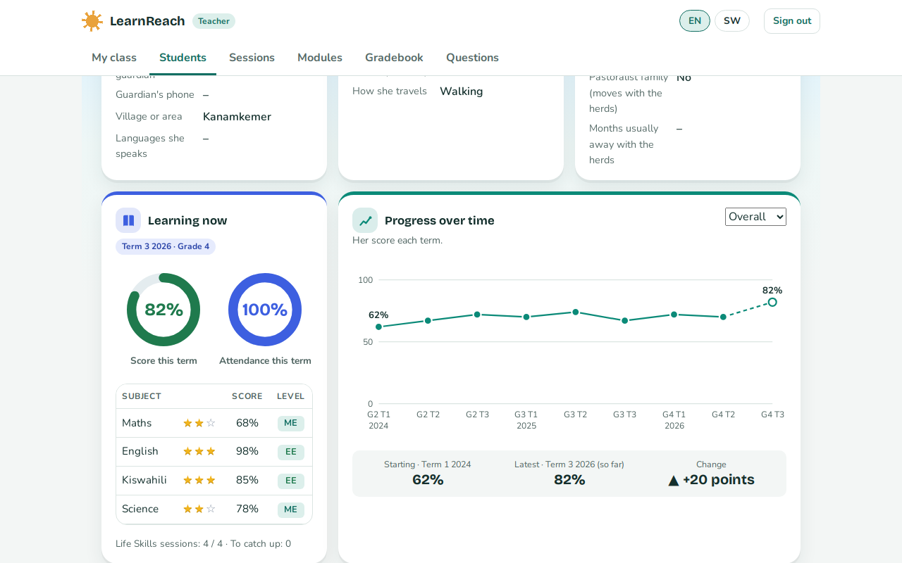
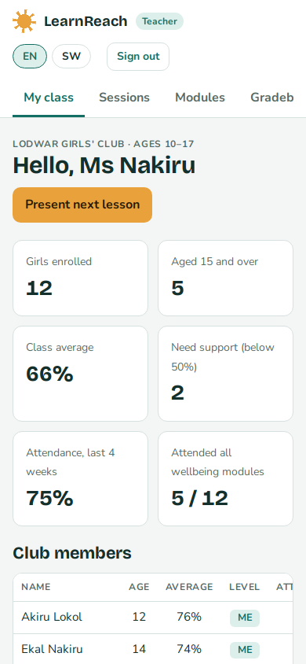

# LearnReach

[](https://github.com/hellenalianya-code/learn/actions/workflows/ci.yml)
[](https://hellenalianya-code.github.io/learn/)
[](LICENSE)

**Offline-first, audio-visual learning and wellbeing platform** by Vivanet Solutions Ltd.

LearnReach brings lessons and essential health information to adolescent girls in underserved and marginalised communities. It works offline or with limited connectivity and runs on solar-powered audio-visual equipment: TVs, projectors, radios and power banks.

## Live links

| Page | Link | For |
| --- | --- | --- |
| **Teacher portal** | [hellenalianya-code.github.io/learn/teacher-portal](https://hellenalianya-code.github.io/learn/teacher-portal/) | Teachers register with their email, sign in and run club sessions |
| **Admin** | [hellenalianya-code.github.io/learn/admin](https://hellenalianya-code.github.io/learn/admin/) | Admins see who has registered and who is signing in |
| Programme dashboard | [hellenalianya-code.github.io/learn/dashboard](https://hellenalianya-code.github.io/learn/dashboard/) | Staff and partners |
| Home | [hellenalianya-code.github.io/learn](https://hellenalianya-code.github.io/learn/) | Landing page |


> **Prototype.** All learners, scores and figures are sample data.

## Showcase

### Teacher portal

A teacher runs a girls' club session: she takes the register, presents a lesson on the classroom TV or projector, asks the class questions and follows each girl's progress term by term.

| My class | Students |
| --- | --- |
|  |  |
| **Modules** | **Gradebook** |
|  |  |

**Classroom screen with pictures and scenes.** Every lesson becomes narrated, full-screen slides for a TV or projector, set in a scene girls know that changes with the grade: savanna with acacias and a giraffe (Grades 1–2), a village with manyattas, goats and maize (3–4), sunset with a solar-powered school, radio mast and camel (5–6), and a dawn with flowers for Life Skills. The class quiz and picture activities use the same scenes. Grade 1–2 Maths, Science and English lessons have drawn pictures on every slide that pop in one by one, so young learners can follow even before they read well. Lessons are starting to get a cover slide that says what the class will learn. Questions come at the end, and the answer stays hidden until the teacher reveals it.

| Lesson cover | Counting at the market |
| --- | --- |
|  |  |

**Each girl's profile.** Tap a name to see her profile: about her, how she gets to school, home situation, and a report card per term with class questions, CATs and (later) exams. **Her journey** shows one circle per class at school: passed grades with a tick and stars, her current grade, and the next one locked. Tap a grade to open its subjects; tap a term to open that report card.

| Profile | Progress over time |
| --- | --- |
|  |  |

<p align="center"></p>

**Grading and wellbeing attendance.** Learning modules are scored out of 100 and mapped to CBC levels (EE, ME, AE, BE). Wellbeing modules record attendance only, and reproductive health is limited to girls aged 15 and over.


<p align="center"></p>

### Programme dashboard

Milestones, learners and sessions, pilot sites, the content library, module completion and budget, in one page.


## Key features

- **Five subjects, Grades 1–6:** Maths, English, Kiswahili and Science (graded), plus Life Skills (not graded). Each girl's class at school decides her lessons in every subject (Grade 7 and above use Grade 6 lessons).
- **Audio-visual lessons:** present any lesson as narrated slides; reading lessons have a Listen button for radio or speaker use. Every lesson is in English and Kiswahili.
- **Lesson pictures:** original drawings on all slides of the Grade 1–2 Maths, Science and English lessons (shapes, counting, the senses, plants, animals, letters), with Kiswahili labels. They work offline.
- **Step-by-step picture activities:** for example "How to wear a pad" and one Maths activity per grade.
- **Sessions:** start class, take the register (present, late, absent), present, then a short class quiz on the shared device. Catch-up lists show who missed which lesson.
- **Students and profiles:** club list with level and attendance bar; profiles saved online (Supabase) with guardian consent before sensitive details; report card per term (class questions, CATs, exams later); Close term saves every girl's report; past paper reports can be added.
- **Teacher analytics:** attendance by week, subject results, girls who need attention, questions to reteach, girls at each grade.
- **Girls' wellbeing:** menstrual health, mental wellbeing, personal safety and reproductive health (15+), never graded.
- **Accounts:** teachers register and sign in (Supabase); admins see sign-ins on the Admin page.
- **Works offline:** the portal opens without internet and uploads changes when the connection comes back.

## Project structure

| Path | What it is |
| --- | --- |
| `teacher-portal/` | The teacher portal (single HTML file) |
| `admin/` | Admin page: registered teachers and sign-ins, live from Supabase |
| `dashboard/` | The programme dashboard; `data/` holds its sample CSVs |
| `supabase/` | Database setup script (`schema.sql`) and setup guide (`SETUP.md`) |
| `supabase-config.js` | Supabase project address and public key, shared by the portal and admin page |
| `index.html` | Landing page for the live demo |
| `scripts/` | Smoke test, media capture and a small static server |
| `docs/images/` | Screenshots and GIFs, regenerated by CI |
| `.github/workflows/` | CI/CD pipelines |

## Run it locally

Open `teacher-portal/index.html` or `dashboard/index.html` in a browser. The portal needs no server or internet. For the dashboard to work fully offline, run `npm install && npm run vendor` once to place `d3.min.js` next to it; otherwise it loads d3 from a CDN.

To run the checks:

```bash
npm install
npx playwright install chromium
npm run vendor
npm test        # smoke test
npm run capture # regenerate docs/images (needs ffmpeg)
```

## CI/CD

| Workflow | When | What it does |
| --- | --- | --- |
| `ci.yml` | Every push and pull request | Runs the smoke test in Chromium: sign-in, classroom screen, gradebook, questions, dashboard charts and the CSV data. On `main` it then builds the site and deploys it to GitHub Pages. |
| `media.yml` | When the portal, dashboard or capture script changes | Re-captures the screenshots and GIFs in `docs/images` and commits them. |

## Design decisions

- **Audio-visual first.** Lessons are designed to be watched and heard together on shared solar-powered screens and radios.
- **Wellbeing is not graded.** Girls' answers in wellbeing sessions are never stored; only attendance is recorded.
- **Age-appropriate content.** Reproductive health is limited to girls aged 15 and over.
- **Offline first.** Pupils and profiles save on the device straight away and upload to Supabase when online. Sessions, attendance, quiz results and questions are still kept in the teacher's browser for now.
- **No photos of children.** Real girls are shown by their initials; only the sample girls have drawn avatars.
- **Pictures that work anywhere.** Lesson pictures are drawn in code (SVG), so they need no downloads and look sharp on any screen.

## Known limitations

- Teacher sign-in uses Supabase (see [`supabase/SETUP.md`](supabase/SETUP.md)). The test account `user1` / `1234` only works in demo mode, when `supabase-config.js` holds placeholders.
- Video and audio lessons need their media files added by the teacher; until then the slides and narration carry the lesson.
- For now every signed-in teacher sees all pupils; linking pupils to their teacher comes next.
- Many devices have no Kiswahili text-to-speech voice; recorded narration is recommended.

## Roadmap

- Cover slides for every lesson, and pictures for Grades 3–6, Kiswahili and Life Skills
- Exams on the report card
- Link pupils to teachers; move sessions, attendance and quiz results to Supabase
- Learner PINs (teacher accounts are done, with Supabase)
- Media library upload and offline caching
- Recorded multilingual narration (Kiswahili, Turkana, Somali)
- AI-assisted multilingual information access

## Open source

LearnReach is developed in the open so schools, NGOs and development organisations can adopt, customise and improve it. Released under the [MIT licence](LICENSE).
